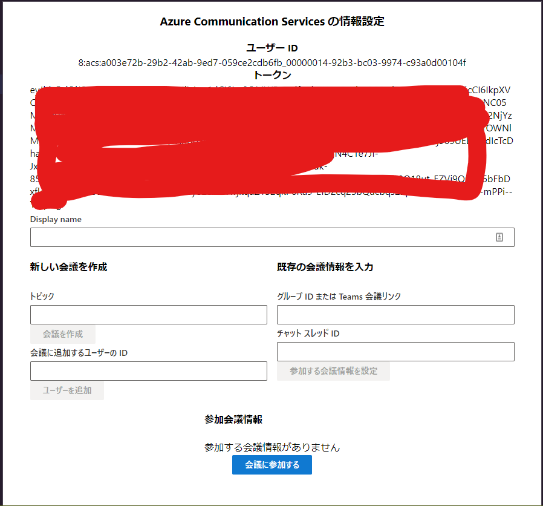

# Getting Started with Create React App

実行方法


1. Node.js v16 をインストール
2. Azure Communication Services を Azure 上に作成
3. Azure Communication Services のキーのページからエンドポイントと接続文字列を取得
4. `.env.local` という名前のファイルを作成して以下の内容に変更
   ```
   REACT_APP_ACS_ENDPOINT=Azure Communication ServicesのエンドポイントのURL
   REACT_APP_ACS_CONNECTION_STRING=Azure Communication Servicesの接続文字列
   ```
5. `npm install --legacy-peer-deps` を実行
6. `npm start` で画面が表示されます。画面が表示される過程でターミナルに source map に関するエラーが出ますが動作には影響ありません。`No issues found.` が最後に表示されれば問題ありません。
7. 以下のような画面が表示されれば動作しています。


